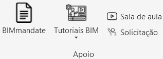

# O que é isso?
Uma barra de ferramentas para uso com o pyRevit desenvolvida por Luís Eduardo com o intuito de agilizar o processo de modelagem e detalhamento 
Me mande um olá se gostou da ideia! 
 
www.linkedin.com/in/luiseduardomaia 
 

# Para que serve?
Automações de modelagem:
* Adicionar revestimentos de ambientes
* Adicionar soleiras em portas

Centralização de documentos:
* Links para tutoriais de modelagem, BIM mandate, etc.
* Links para templates e bibliotecas.

# Como instalar?
O primeiro passo é instalar o pyRevit:https://github.com/eirannejad/pyRevit/releases

Após essa instalação é necessário clonar esse repostorio e inserir ele no seu pyRevit 
Alguns ajustes nos códigos serão necessários para se adequar ao seu padrão de organização. Em breve mais detalhes sobre esse processo.

# Personalizando: Links de apoio

Nas sub-pastas localizadas em `LuisBIM.tab\Apoio.Panel` existem vários arquivos `bundle.yaml` 
Todos esses arquivos contem um link para uma pagina do google, basta substituir esse link no arquivo para arquivo de sua escolha

