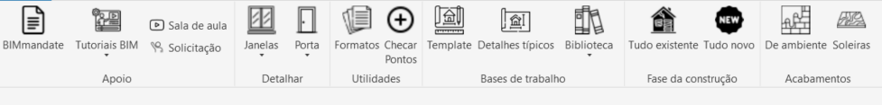

# O que é isso?
Uma barra de ferramentas para uso com o pyRevit desenvolvida por Luís Eduardo com o intuito de agilizar o processo de modelagem e detalhamento 
Me dmande um Olá se gostou da ideia! 
www.linkedin.com/in/luiseduardomaia

# Para que serve?
Automações de modelagem: 
-Adicionar revestimentos de ambientes 
-Adicionar soleiras em portas 
-Mudar fases de construção 
-Criar detalhes de portas e janelas 
 
Centralização de documentos: 
-Links para tutoriais de modelage, BIM mandate, templates, etc.

# Como instalar e usar?
O primeiro passo é instalar o pyRevit:https://github.com/eirannejad/pyRevit/releases

Após essa instalação é necessário clonar esse repostorio e inserir ele no seu pyRevit 
Alguns ajustes nos codigos serão necessários para se adequar ao seu padrão de organização. Em breve mais detalhes sobre esse processo.

